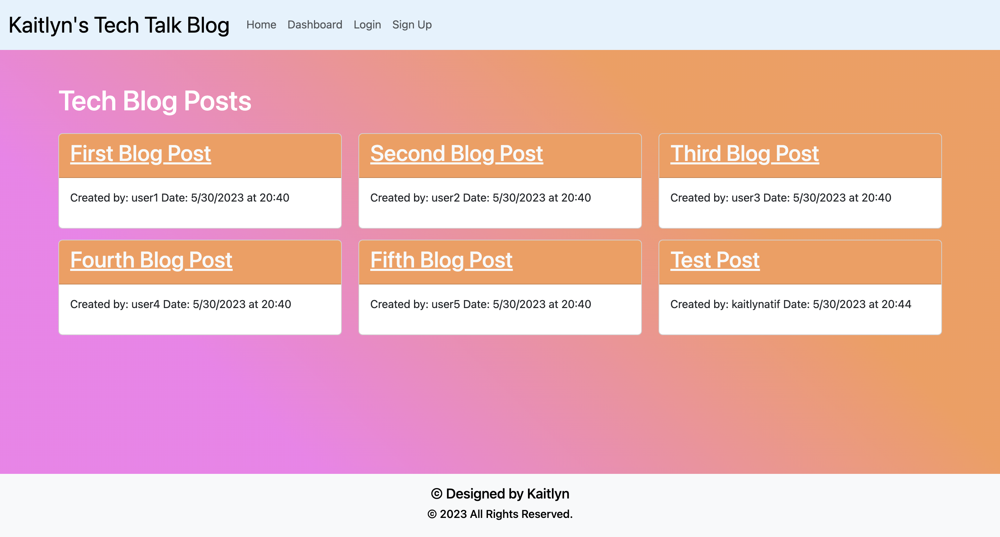
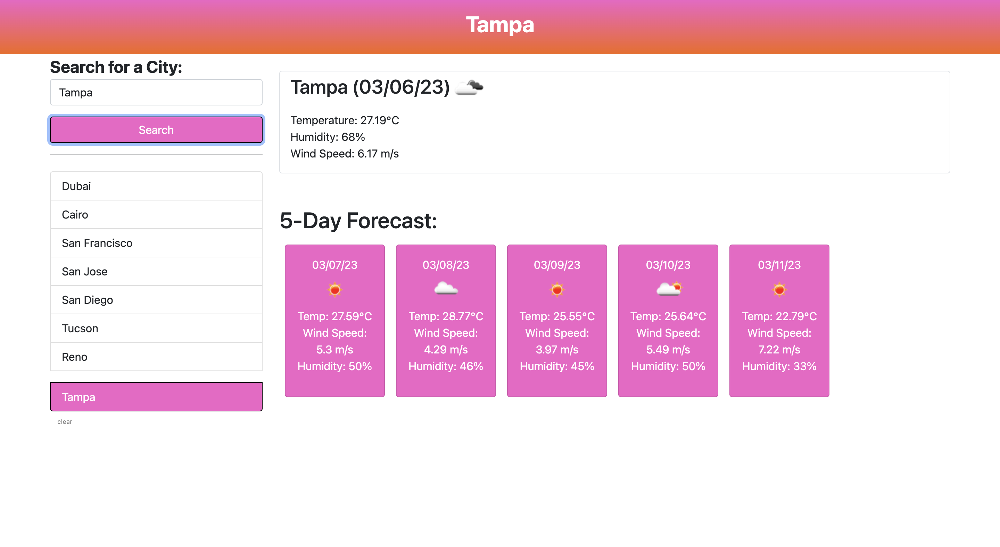
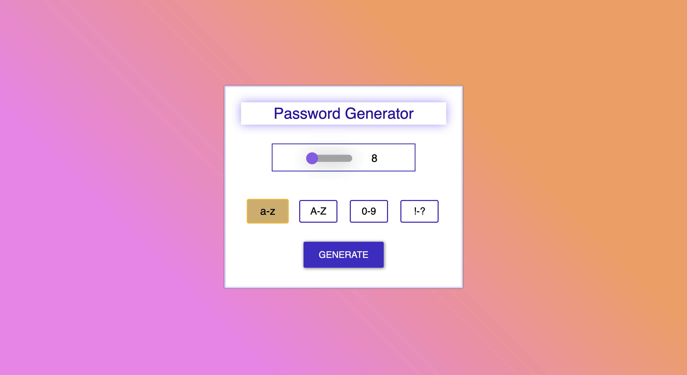
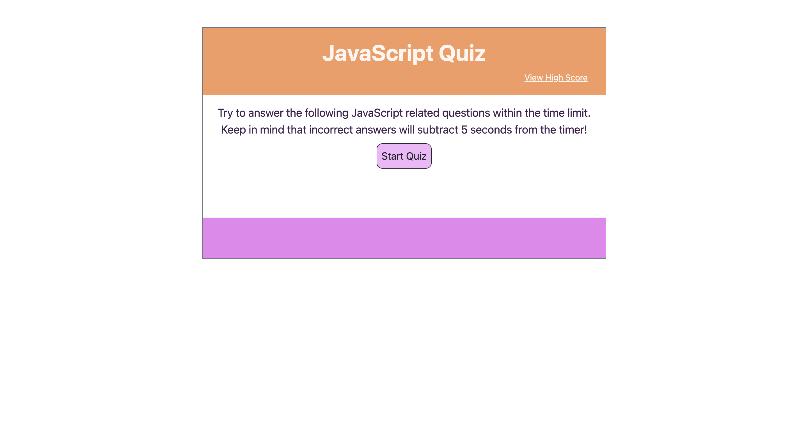

<h1 align="center">Greetings, my name is Kaitlyn Atif</h1>
<h3 align="center">Protein Biochemist | Full-Stack Software Developer | Military Spouse</h3>

                 <a href="mailto:kaitlynatif90@hotmail.com">Email</a> | <a href="https://linkedin.com/in/kaitlyn-atif">LinkedIn</a> | <a href="https://kaitlynatif.github.io/React_Portfolio/">Portfolio</a> | <a href="https://docs.google.com/document/d/1CHWBDOIqKxRqLzFAYzwyBkJ0arhWOtL4Llaiw2eimps/edit?usp=sharing">Resume</a>
                 

I am a protein Biochemist with over ten years of laboratory bench experience and over five years of experience in IgG therapeutics—specifically the downstream stages of the mAb (monoclonal antibody) drug development process—aspiring to pivot into a role as a full-stack software developer. I have a strong foundation in experiment design, process development, data analysis, troubleshooting, and working in team-oriented and collaborative environments.

**I am open to collaborate on interesting and innovative projects.**

- 🔭 I’m currently building my portfolio through my work via the Full-Stack Web Development Boot Camp at the Georgia Institute of Technology.
- 💻 The tech stack I’m currently learning ...
  - Computer science applied to Javascript: Algorithms (Searches, Sorts), Performance, Time Complexity, Big O Notation, Data Structures, Design Patterns.
  - Browser-based technologies: HTML, CSS, JavaScript, jQuery, Responsive Design, Bootstrap, Progressive Web Applications (PWAs), Local Storage, Session     Storage, IndexedDB, React.js.
  - API Design: Client-Server Model API, REST, JSON, AJAX (Fetch API), HTTP request methods, GraphQL.
  - Databases: MySQL, MongoDB.
  - Deployment and Delivery: Heroku, Git, GitHub Pages, Shell Scripting, Unit Testing, Linting, Continuous Integration.
  - Server Side Development: Node.js, Express.js, User Authentication, Template Engines, MERN Stack
  (MongoDB, Express.js, React.js, Node.js).
  - Languages: JavaScript, Python, Java, Amazon Web Servers (AWS), C#
  - Tools: VS Code, Command Line

<h1 align="center">Projects</h1>
<table bordercolor="#66b2b2">
  
  <tr>
    <td width="50%" valign="top">
      <h3 align="center">Tech Blog</h3>
         
        
         
        

          
  <a href="https://github.com/kaitlynatif/Tech_Blog" target="_blank">
    Repository
  </a> | 
  <a href="https://obscure-beach-63742.herokuapp.com/" target="_blank">
    Live Demo
  </a>
      

        
<strong>A CMS-style blog site similar to a Wordpress site, where developers can publish their blog posts and comment on other developers’ posts as well.

    </td>
    <td width="50%" valign="top">
      <h3 align="center">Weather Forecast Dashboard</h3>
         
      
         
        

          
  <a href="https://github.com/kaitlynatif/Weather_Forecast_Dashboard" target="_blank">
    Repository
  </a> | 
  <a href="https://kaitlynatif.github.io/Weather_Forecast_Dashboard/" target="_blank">
    Live Demo
  </a>
      

        
<strong>A weather dashboard that runs in the browser and features dynamically updated HTML and CSS. The application features a search option for a specific city along with a list of cities from the search history. The weather dashboard also features a five day weather forecast and current weather conditions for a given city.

    </td>
  </tr>
  
  <tr>
    <td width="50%" valign="top">
      <h3 align="center">Random Password Generator</h3>
       
        
       
        

  <a href="https://github.com/kaitlynatif/Random_Password_Generator" target="_blank">
    Repository
  </a> | 
  <a href="https://kaitlynatif.github.io/Random_Password_Generator/" target="_blank">
    Live Demo
  </a>
      

        
<strong>A JavaScript application to generate random passwords utilizing selected criteria.

    </td>
    <td width="50%" valign="top">
      <h3 align="center">JavaScript Quiz</h3>
         
        
         
        

          
  <a href="https://github.com/kaitlynatif/Coding_Quiz" target="_blank">
    Repository
  </a> | 
  <a href="https://kaitlynatif.github.io/Coding_Quiz/" target="_blank">
    Video Demo
  </a>
      

        
<strong>A timed quiz on JavaScript fundamentals that stores high scores.

    </td>
  </tr>
</table>
